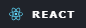
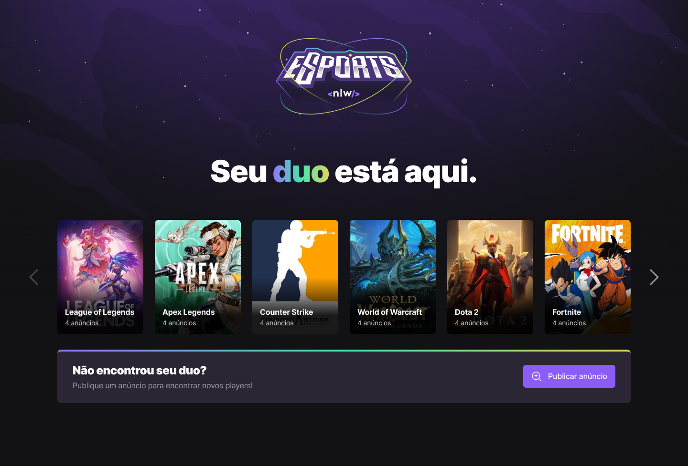
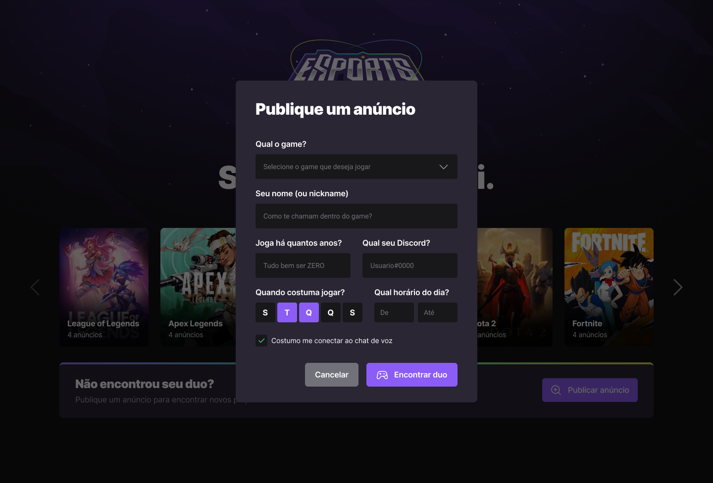

# NLW IGNITE - PROJETO WEB v. 1.00

<h1>

</h1>


     


## Sobre


<p>NLW eSports é o projeto desenvolvido durante a trilha Ignite da Next Level Week, um evento online produzido pela Rocketseat.

Trata-se de uma landing page que permite os usuários buscarem seu duo (dupla) em jogos online e publicar um anúncio para encontrar outros jogadores no jogo que desejar.</p>



## ✨ Features
 - Listagem de games (web e mobile)
 - Criação de um novo anúncio (web)
 - Design totalmente responsivo (web)
 - Feedbacks para o usuário: loading durante criação, toast de sucesso e erro (web)

 ## 🚀 Tecnologias e ferramentas utilizadas
 - Front-end (web):	React, TypeScript, TailwindCSS, Vite, RadixUI, Phosphor Icons
 - Back-end:	NodeJs e Prisma

 ## 📟 Layout
<p>O layout das telas da aplicação NLW eSports foi desenvolvido pela equipe da Rocketseat através da ferramenta <a href="https://www.figma.com/">Figma</a>, um software de prototipação voltado para UI Design (design de interfaces de usuário). Você pode acessar o layout através deste link: <a href="https://www.figma.com/community/file/1150897317533332617">NLW eSports.</a></p>

# 🔧 Instalação e execução
Para baixar o código-fonte do projeto em sua máquina, primeiramente terá que ter instalado o Git.

Com o Git instalado, em seu terminal execute o seguinte comando:

```
git clone https://github.com/felipeneneu/esports.git
```
Para instalar as dependências e executar o projeto terá que ter instalado em sua máquina o Node.js, que vem acompanhado do NPM. Com ele instalado:

Navegue para as subpastas separadas para cada projeto (web/server) e rode o comando a seguir:

```
npm install
```

Executar o projeto web:
```
npm run dev
```

Executar o servidor node:
``` 
npm run dev
```
## 💡 Como contribuir
- Faça um fork desse repositório;
- Crie um branch para a sua feature: git checkout -b minha-feature;
- Faça um commit com suas alterações: git commit -m 'feat: Minha nova feature';
- Faça um push para o seu branch: git push origin minha-feature;
- Faça um pull request com sua feature;
- Pull requests são sempre bem-vindos. Em caso de dúvidas ou sugestões, crie uma issue ou entre em contato comigo.

<h2><center>©2024 - Felipe Neneu</center></h2>